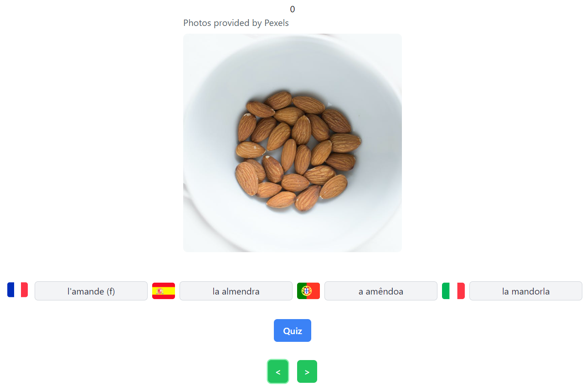
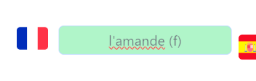
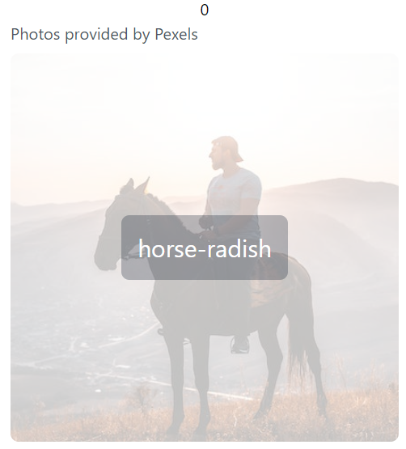

# Romance

Available here: <a href="https://eoinmtreacy.github.io/romance/">https://eoinmtreacy.github.io/romance/</a>

  There's an was interesting book, <a href="https://books.google.ie/books/about/The_Loom_of_Language.html?id=g24XKBDPOYcC&redir_esc=y">The Loom of Language</a>, written in the 40s about the merits of learning many languages of the same family 
   at ths same time.

    The logic being that it's not much more effort to learn vocabulary of multiple languages that share the same etymological roots: I made an small app to quiz you on food in the romance languages.

    It's crucial to point out that the images are just API request to an image service, so sometimes they may not be so accurate. That's why I added the hover.

  If you want to add your own vocabularly it's easily done, just check out the structure of the JSON and you can easily add your own.

